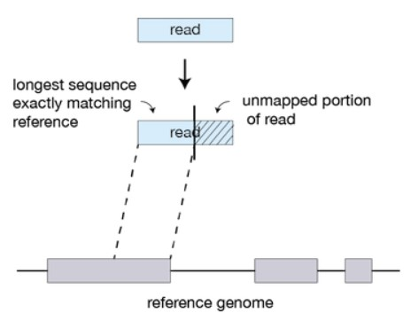

# [Franco](https://github.com/altsplicer) / [***STAR alignment***]

Script [LINK](https://github.com/Altsplicer/STAR_alignment_script/blob/main/bash/STAR_align.sub)

[](#nolink)

## Overview

This a script used to map reads using the STAR aligner.
For a tutorial see [link](https://hbctraining.github.io/Intro-to-rnaseq-hpc-O2/lessons/03_alignment.html)

## Slurm script headers
UCI uses the SLURM scheduler so you must use slurm headers to specify how and where you want the job to run. 
You must also name the script SCRIPT_NAME.sub and then run the script using "Sbatch SCRIPT_NAME.sub", while you are in the working directory of the script location. 

For a more in depth view on a SLURM job script headers see https://rcic.uci.edu/slurm/examples.html.

Make note that this script uses the free partition but you can use your free 1000 core hours of the lab's core hours by changing the header.
Otherwise your job can be killed in the free partition.
``` bash
#!/bin/bash
#SBATCH --job-name=star_align	## Name of the job.
#SBATCH -p free				## partition/queue name
#SBATCH --nodes=8			##(-N) number of nodes to use
#SBATCH --mem=100G ## request 100GB of memory
#SBATCH -e /dfs3b/hertel-lab/fcarranz/project_name/alignments/star_align.err	##Error_log
#SBATCH -o /dfs3b/hertel-lab/fcarranz/project_name/alignments/star_build.out	##outputfile_log
#SBATCH --mail-user fcarranz@uci.edu
#SBATCH --mail-type=ALL
```

## Load in required modules
``` bash
module load star/2.7.10a
module load python/3.8.0
module load samtools/1.10

echo "You're aligning on $HOSTNAME"
```

## Setting up parameters for alignment run
``` bash
#number of threads. MUST match the sub header openmp value you chose
P=8
#where the fastq sample (reads) sequences are
#data is paired end
DATA_DIR=/dfs3b/hertel-lab/fcarranz/project_name
```

Annotation file
``` bash
REF_ANNOTATION=data/homezvol2/fcarranz/GTF/v45/gencode.v45.primary_assembly.basic.annotation.gtf
```

Path to the index files for star. this replaces the reference genome because it is an indexed version of the fasta file
``` bash
INDEX=${DATA_DIR}/star_index
```

Desired directory for output alignments
``` bash
OUT_DIR=${DATA_DIR}/alignments

# Making the result file directory
mkdir -p ${OUT_DIR}
```

## Alignment of paired end samples

Here we are performing a loop that will use each file whoese context matches the loop in the indicated directory.
Each file will be processed with the STAR aligner, "\" symbol indicates that more options for the program are on the next line.
``` bash
#Iterate over each sample
#example of input fastq file names
#HBR refer to a test condition
#1 and 2 refers to replicates 
#R1 read1 (paired end)
#R2 read2 (paired end)
#HBR_1_R1.fq.gz
#HBR_1_R2.fq.gz

for SAMPLE in HBR;
do
    # Iterate over each of the replicates.
    for REPLICATE in 1 2 3;
    do
        # Build the name of the files.
        R1=${DATA_DIR}/PE_trimmed_data/${SAMPLE}_${REPLICATE}_R1.fq.gz
        R2=${DATA_DIR}/PE_trimmed_data/${SAMPLE}_${REPLICATE}_R2.fq.gz

        # Run the aligner.
		echo "Aligning ${R1} and ${R2}"


		STAR --chimSegmentMin 15 --chimJunctionOverhangMin 15 --outFilterMismatchNmax 3 --alignEndsType Local  --runThreadN $P \
		--outFilterMultimapNmax 1 --outBAMcompression 10 --outBAMsortingThreadN $P \
		--quantMode GeneCounts  TranscriptomeSAM  --quantTranscriptomeBAMcompression 10 \
		--outSAMtype BAM SortedByCoordinate --alignSJDBoverhangMin 6 --alignIntronMax 300000 --genomeDir $INDEX \
		--sjdbGTFfile $REF_ANNOTATION --outFileNamePrefix ${OUT_DIR}/${SAMPLE}_${REPLICATE}.star \
		--readFilesCommand zcat --readFilesIn ${R1} ${R2}

		echo "Alignment of ${R1} and ${R2} complete"
    done
done

exit
```
# STAR options

STAR --chimSegmentMin 15 --chimJunctionOverhangMin 15 \ #allows for circRNA detection

--outFilterMismatchNmax 3 \ #maximum mismatches allowed

--alignEndsType Local  --runThreadN $P \ #type of alignment and number of threads.Local is standard local alignment with soft-clipping allowed

--quantMode GeneCounts  TranscriptomeSAM  --quantTranscriptomeBAMcompression 10 \ #performs gene counts like HTSEQ union mode. Just exons counts. max compression

--outFilterMultimapNmax 1 \ # default is 10.setting this to 1 will limit the bam file to contain only TRULY uniquely mapped reads. Stats will still contain multimap info, but the definition of a multipmapper more correct by setting this to 1 instead of 10 $

--outSAMstrandField intronMotif --outSAMtype BAM SortedByCoordinate \

--outBAMcompression 10 --outBAMsortingThreadN $P \ #these features increase compression and compression speed by multithreading more than the default 6 threads

--alignSJDBoverhangMin 6 --alignIntronMax 300000 \ #default intron is 0. if this is 0 it turns off splicing detection.  default overhang is 5

# NOTES:
--outSAMstrandField intronMotif needed if non stranded data

.run this if error produced. input error amount --limitBAMsortRAM 30943606211

Note if you run out of ram, tactic is to take out BAM sorted option to yield unsorted then do it separately with samtools.

Further options can be found in the STAR aligner [Documentation](https://github.com/alexdobin/STAR/blob/master/doc/STARmanual.pdf)

# Please note if any of these commands are not sent in as slurm job but done in the terminal then you need to be in a interactive node, NOT THE LOGIN NODE! You will get in trouble with UCI's HPC staff. 
